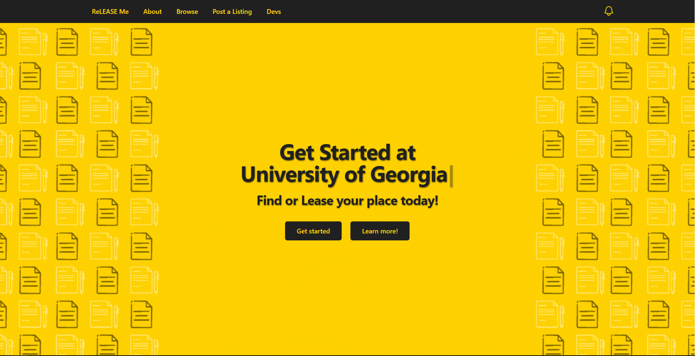
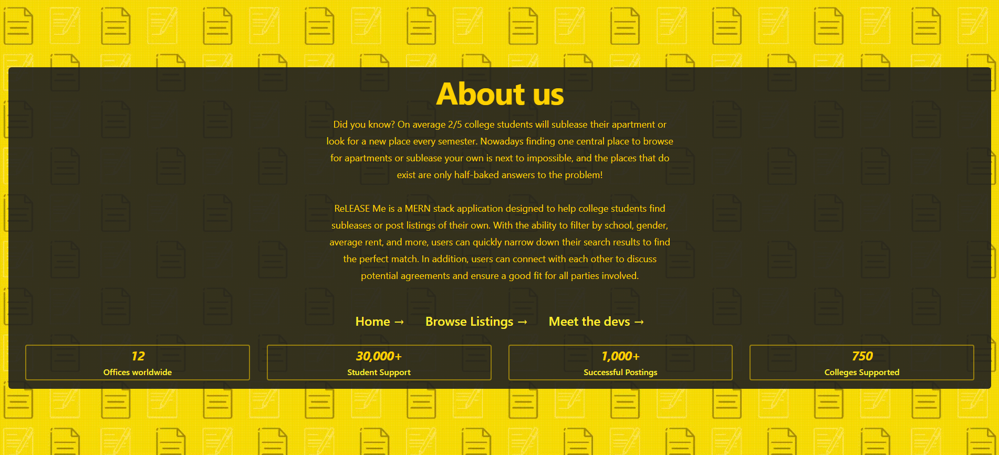
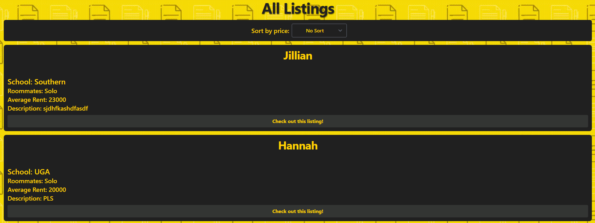
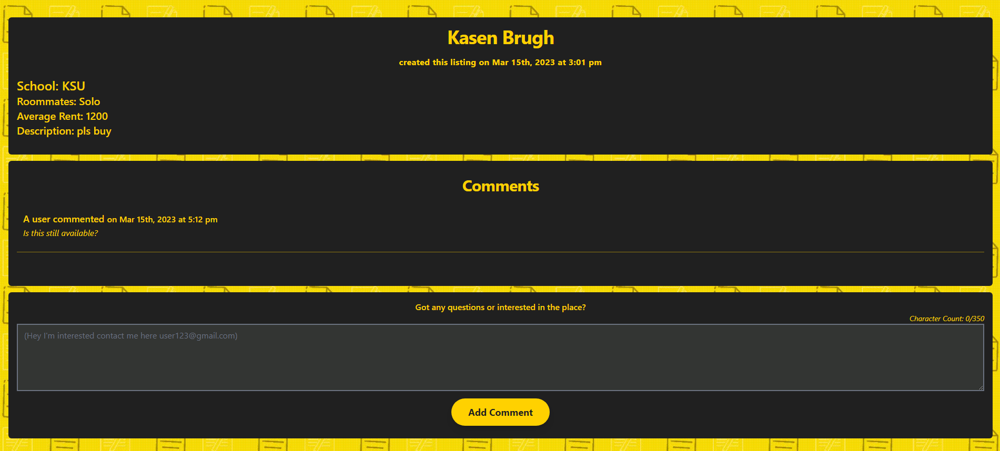
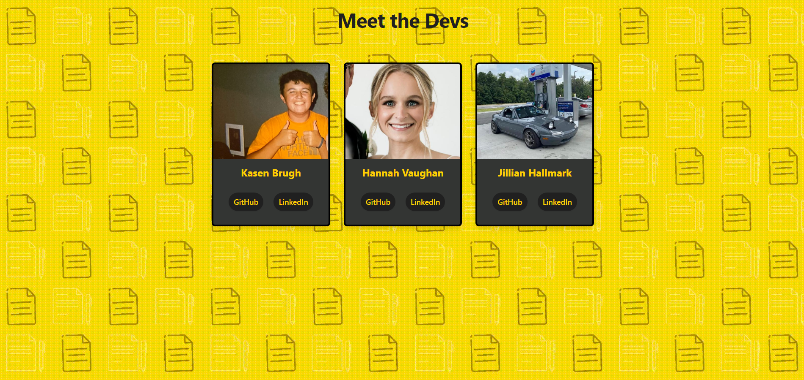

# ReLEASE Me!

## Description

reLEASE Me is a MERN stack application designed to help college students find subleases or post listings of their own. With the ability to filter by school, gender, average rent, and more, users can quickly narrow down their search results to find the perfect match. In addition, users can connect with each other to discuss potential agreements and ensure a good fit for all parties involved.

## Table of Contents

- [Motivation](#motivation)
- [User Story](#user-story)
- [Link to Site](#link)
- [Screenshots](#screenshots)
- [License](#license)
- [Credits](#credits)
- [Badges](#badges)

## Motivation

One of our developers Kasen had this idea because of an issue he recently faced before moving. There were a ton of smaller places where you could post subleases or find ones to take over but not one central location for college kids to use. So we sought to potentially solve this issue with ReLEASE Me!

## User story

```
AS A COLLEGE STUDENT, I want a site where I can post subleases or browse for ones I can take over.
WHEN I view the homepage,
THEN I am presented with a greeting and a get started or learn more section
WHEN I go to get started page,
THEN I am presented with options to create my own listing
WHEN I create a new listing,
THEN My information gets saved to the database.
WHEN I view the browse listings tab,
THEN I can see my listing and any others.
WHEN I click on a listing,
THEN I can view any extra details & comment.
```

## Link

You can view the deployed application via heroku [here!](https://re-lease-me.herokuapp.com/)

## Screenshots







## License

This project is licensed under the MIT license.
<br/> [](https://opensource.org/licenses/MIT)

## Credits

- [Kasen Brugh](https://github.com/BrughK)
- [Hannah Vaughan](https://github.com/hannahsvaughan)
- [Jillian Hallmark](https://github.com/hakuxo)

## Badges

   <br />     <br />   
